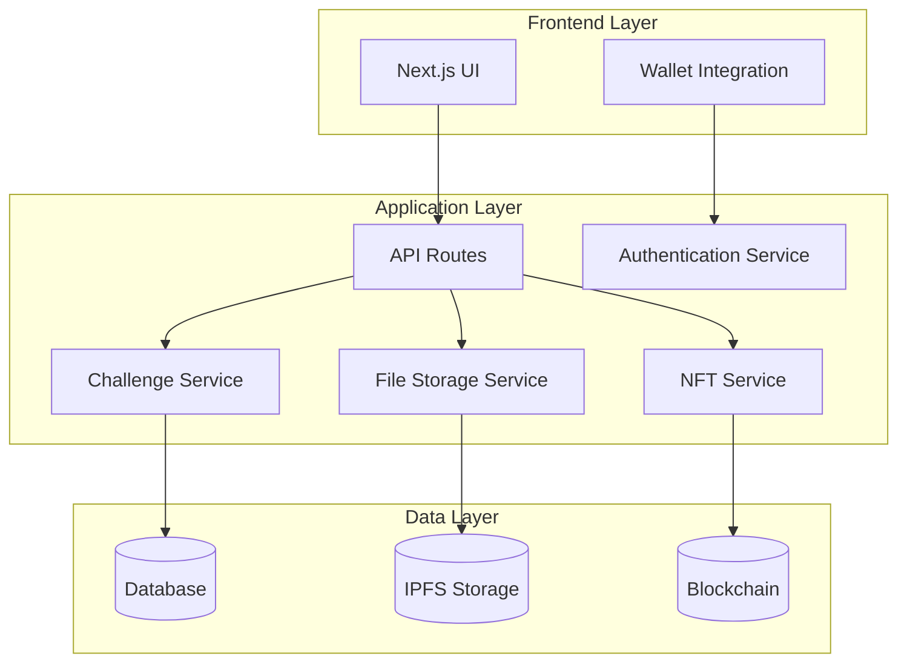
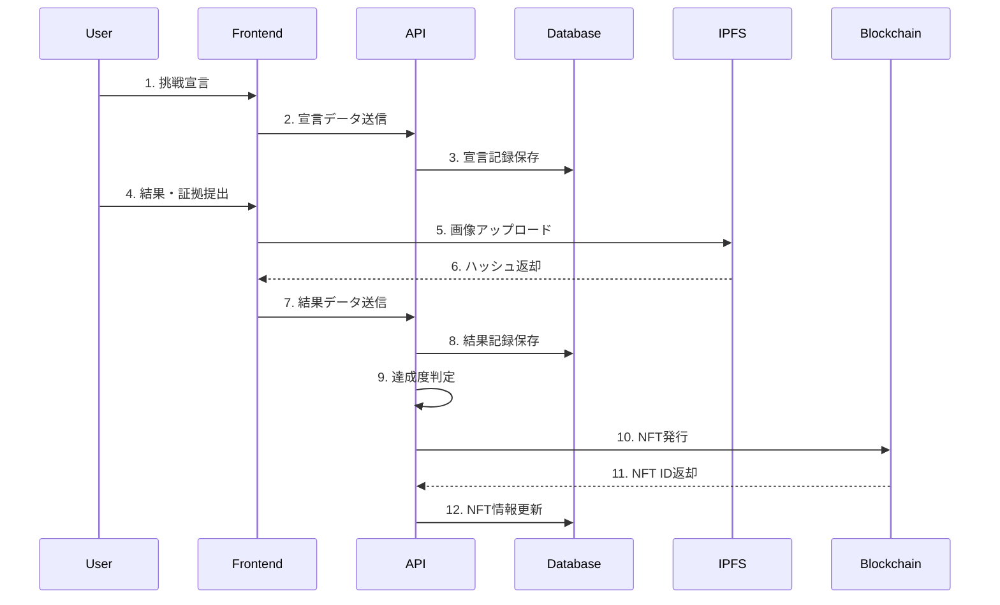
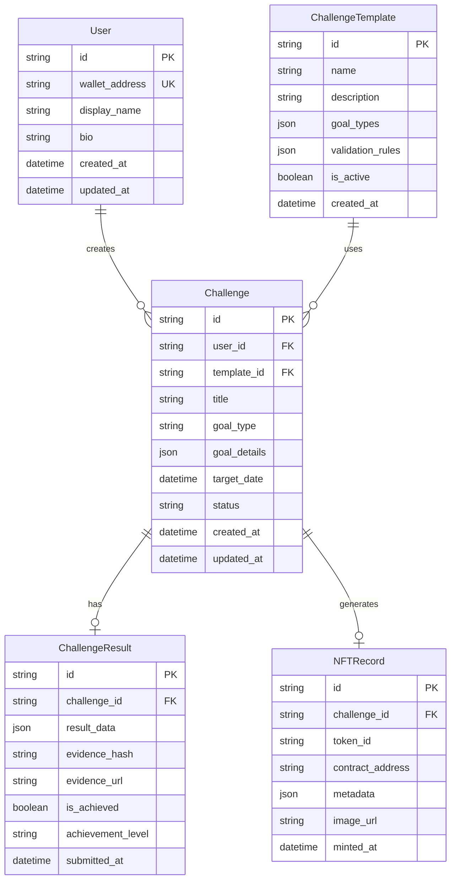

# Marathon Challenge Protocol - Design Document

## Overview

Marathon Challenge Protocolは、汎用的なチャレンジ管理システムとして設計され、マラソンを最初のユースケースとして実装します。システムは「宣言→実行→結果→確認」のプロトコルを基盤とし、将来的に読書、ダイエット、学習など様々な挑戦に応用可能な拡張性を持ちます。

## Architecture

### システム全体構成



### データフロー



## Data Models

### ER図



### データモデル詳細

#### User（ユーザー）
```typescript
interface User {
  id: string;                    // UUID
  walletAddress: string;         // ウォレットアドレス（一意）
  displayName?: string;          // 表示名
  bio?: string;                  // 自己紹介
  createdAt: Date;
  updatedAt: Date;
}
```

#### ChallengeTemplate（チャレンジテンプレート）
```typescript
interface ChallengeTemplate {
  id: string;                    // UUID
  name: string;                  // テンプレート名（例: "Marathon"）
  description: string;           // 説明
  goalTypes: GoalType[];         // 利用可能な目標タイプ
  validationRules: ValidationRule[]; // 検証ルール
  isActive: boolean;             // 有効フラグ
  createdAt: Date;
}

interface GoalType {
  id: string;                    // 例: "completion", "sub4", "sub3"
  name: string;                  // 表示名
  description: string;
  targetValue?: number;          // 目標値（秒単位）
}
```

#### Challenge（チャレンジ）
```typescript
interface Challenge {
  id: string;                    // UUID
  userId: string;                // ユーザーID
  templateId: string;            // テンプレートID
  title: string;                 // チャレンジタイトル（例: "東京マラソン2024"）
  goalType: string;              // 目標タイプID
  goalDetails: {                 // 目標詳細
    targetTime?: number;         // 目標タイム（秒）
    customGoal?: string;         // カスタム目標
  };
  targetDate: Date;              // 実施予定日
  status: ChallengeStatus;       // ステータス
  createdAt: Date;
  updatedAt: Date;
}

enum ChallengeStatus {
  DECLARED = "declared",         // 宣言済み
  IN_PROGRESS = "in_progress",   // 実行中
  COMPLETED = "completed",       // 完了
  CANCELLED = "cancelled"        // キャンセル
}
```

#### ChallengeResult（チャレンジ結果）
```typescript
interface ChallengeResult {
  id: string;                    // UUID
  challengeId: string;           // チャレンジID
  resultData: {                  // 結果データ
    actualTime?: number;         // 実際のタイム（秒）
    isCompleted: boolean;        // 完走フラグ
    dnfReason?: string;          // 未完走理由
    additionalNotes?: string;    // 追加メモ
  };
  evidenceHash: string;          // 証拠画像のハッシュ
  evidenceUrl: string;           // 証拠画像のURL（IPFS）
  isAchieved: boolean;           // 目標達成フラグ
  achievementLevel: AchievementLevel; // 達成レベル
  submittedAt: Date;
}

enum AchievementLevel {
  GOLD = "gold",                 // 目標達成
  SILVER = "silver",             // 完走（目標未達成）
  BRONZE = "bronze"              // 挑戦（未完走）
}
```

#### NFTRecord（NFT記録）
```typescript
interface NFTRecord {
  id: string;                    // UUID
  challengeId: string;           // チャレンジID
  tokenId: string;               // NFTトークンID
  contractAddress: string;       // コントラクトアドレス
  metadata: NFTMetadata;         // NFTメタデータ
  imageUrl: string;              // NFT画像URL
  mintedAt: Date;
}

interface NFTMetadata {
  name: string;                  // NFT名
  description: string;           // 説明
  image: string;                 // 画像URL
  attributes: {                  // 属性
    challenge_type: string;
    goal_type: string;
    achievement_level: string;
    event_date: string;
    result_time?: string;
  };
}
```

## Components and Interfaces

### フロントエンド コンポーネント構成

```
src/
├── app/
│   ├── page.tsx                    # ダッシュボード
│   ├── challenges/
│   │   ├── page.tsx               # チャレンジ一覧
│   │   ├── new/page.tsx           # 新規チャレンジ作成
│   │   └── [id]/
│   │       ├── page.tsx           # チャレンジ詳細
│   │       └── result/page.tsx    # 結果入力
│   ├── profile/page.tsx           # プロフィール
│   └── nfts/page.tsx             # NFTコレクション
├── components/
│   ├── ui/                        # 基本UIコンポーネント
│   ├── challenge/                 # チャレンジ関連コンポーネント
│   ├── nft/                      # NFT関連コンポーネント
│   └── layout/                   # レイアウトコンポーネント
├── hooks/                        # カスタムフック
├── lib/                          # ユーティリティ
├── services/                     # API通信
└── types/                        # 型定義
```

### API エンドポイント設計

```typescript
// チャレンジ関連
GET    /api/challenges              // チャレンジ一覧取得
POST   /api/challenges              // 新規チャレンジ作成
GET    /api/challenges/[id]         // チャレンジ詳細取得
PUT    /api/challenges/[id]         // チャレンジ更新
DELETE /api/challenges/[id]         // チャレンジ削除

// 結果関連
POST   /api/challenges/[id]/result  // 結果提出
GET    /api/challenges/[id]/result  // 結果取得

// NFT関連
GET    /api/nfts                    // NFT一覧取得
POST   /api/nfts/mint              // NFT発行
GET    /api/nfts/[tokenId]         // NFT詳細取得

// ユーザー関連
GET    /api/user/profile           // プロフィール取得
PUT    /api/user/profile           // プロフィール更新
GET    /api/user/stats             // 統計情報取得

// テンプレート関連
GET    /api/templates              // テンプレート一覧取得
GET    /api/templates/[id]         // テンプレート詳細取得
```

## Error Handling

### エラー分類と対応

```typescript
enum ErrorType {
  VALIDATION_ERROR = "validation_error",
  AUTHENTICATION_ERROR = "authentication_error",
  AUTHORIZATION_ERROR = "authorization_error",
  NOT_FOUND_ERROR = "not_found_error",
  BLOCKCHAIN_ERROR = "blockchain_error",
  STORAGE_ERROR = "storage_error",
  INTERNAL_ERROR = "internal_error"
}

interface APIError {
  type: ErrorType;
  message: string;
  details?: any;
  timestamp: Date;
}
```

### エラーハンドリング戦略

1. **バリデーションエラー**: フロントエンドで即座にフィードバック
2. **認証エラー**: ウォレット再接続を促す
3. **ブロックチェーンエラー**: リトライ機能付きで再実行
4. **ストレージエラー**: 代替保存方法を提案
5. **内部エラー**: ログ記録とユーザーへの適切な通知

## Testing Strategy

### テスト構成

```typescript
// 単体テスト
describe('Challenge Service', () => {
  test('should create challenge with valid data');
  test('should validate goal achievement correctly');
  test('should handle invalid input gracefully');
});

// 統合テスト
describe('Challenge API', () => {
  test('should create and retrieve challenge');
  test('should submit result and mint NFT');
});

// E2Eテスト
describe('User Journey', () => {
  test('should complete full challenge lifecycle');
  test('should display NFT collection correctly');
});
```

### テストデータ

```typescript
const mockChallengeTemplate = {
  id: "marathon-template",
  name: "Marathon",
  goalTypes: [
    { id: "completion", name: "完走", targetValue: null },
    { id: "sub4", name: "サブ4", targetValue: 14400 },
    { id: "sub3", name: "サブ3", targetValue: 10800 }
  ]
};
```

## 拡張性設計

### 汎用化のための抽象化

1. **ChallengeTemplate**: 新しい挑戦タイプを簡単に追加
2. **GoalType**: 柔軟な目標設定システム
3. **ValidationRule**: カスタム検証ロジック
4. **AchievementLevel**: 達成度評価の拡張

### 将来の拡張例

```typescript
// 読書チャレンジテンプレート
const readingTemplate = {
  name: "Reading",
  goalTypes: [
    { id: "pages", name: "ページ数", targetValue: 300 },
    { id: "books", name: "冊数", targetValue: 12 }
  ]
};

// ダイエットチャレンジテンプレート
const dietTemplate = {
  name: "Diet",
  goalTypes: [
    { id: "weight_loss", name: "減量", targetValue: 5 },
    { id: "body_fat", name: "体脂肪率", targetValue: 15 }
  ]
};
```

この設計により、マラソン以外の様々な挑戦にも対応可能な拡張性の高いシステムを構築できます。